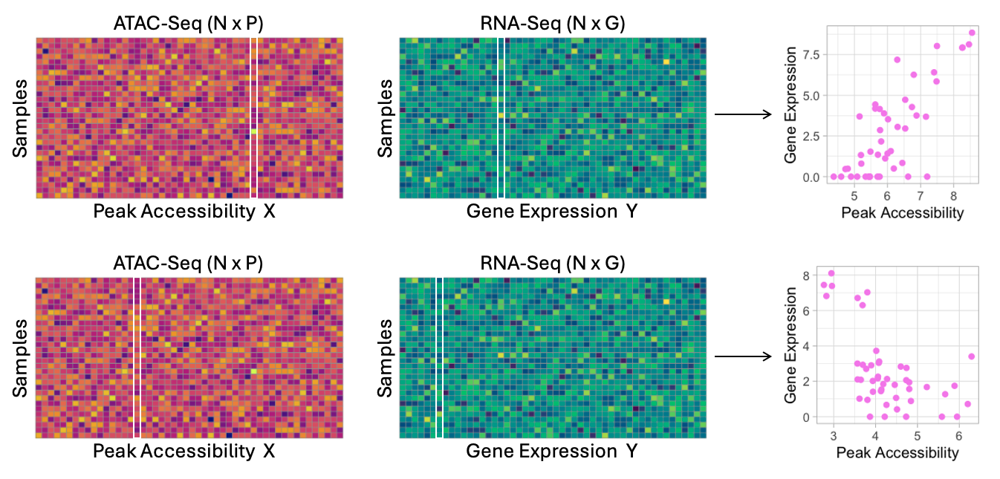

# PETScan: Score-Based Genome-Wide Association Analysis of RNA-Seq and ATAC-Seq Data



## Overview

Accessible chromatin allows transcription factors and regulatory elements to bind to DNA, thereby regulating transcription through the activation or repression of target genes.
PETScan performs score-based genome-wide association analysis of RNA-Seq and ATAC-Seq data using negative binomial models to uncover gene regulatory mechanisms. 

## Installation

```R
install.packages("devtools")
devtools::install_github("yajing-hao/PETScan")
```

## Vignettes

For illustration, we load paired RNA-Seq and ATAC-Seq data from various human tissues obtained from ENCODE, consisting of 46 subjects, 20 genes, and 100 peaks.

```R
library(PETScan)
RNA = ENCODE_RNA
ATAC = ENCODE_ATAC
cvrt = ENCODE_cvrt[,2:4]
```

We conduct score-based genome-wide association analysis across all RNA-Seq genes and ATAC-Seq peaks using negative binomial models.

```R
nb1 = PETScan(Ymat=RNA, X=cvrt, A=ATAC, perm=2, no_cores=8, seed=1)
```

The ($i,j$) element of the returned matrix represents the score test statistic for the $i$-th ATAC-Seq peak and the $j$-th RNA-Seq gene. The last row contains the median of permuted score test statistics for each gene.

Then we apply genomic control methods and visualize significant gene-peak pairs, with peak locations on the X-axis and gene locations on the Y-axis. Different levels of significance are indicated using different colors.

```R
nrow1 = nrow(ATAC)
score1 = nb1[1:nrow1, ]
gc1 = nb1[nrow1+1, ] / 0.456
gc1 = ifelse(gc1>1, gc1, 1)
score2 = t(t(score1) / gc1) %>% data.frame()
score2$ATAC = rownames(score2)

RNApos = ENCODE_RNApos
ATACpos = ENCODE_ATACpos
score3 = reshape2::melt(score2, id.vars="ATAC") %>%
  mutate(pvalue = 1 - pchisq(value, 1)) %>%
  mutate(padj = p.adjust(pvalue, method="BH")) %>%
  left_join(RNApos, by=c("variable"="gene")) %>%
  left_join(ATACpos, by=c("ATAC"="peak"))

PETScan.plot(score3$geneid, score3$peakid, score3$padj,
          scuts = c(0.2, 0.1, 0.05, 0.01),
          cols = c("yellow", "green", "blue", "red"),
          eChr = RNApos$g.chr, ePos = RNApos$g.start,
          pChr = ATACpos$p.chr, pPos = ATACpos$p.start,
          chroms = c(1:22, "X"))
```

## Author
Yajing Hao, Fei Zou

## Maintainer
Yajing Hao <yajingh@live.unc.edu>
